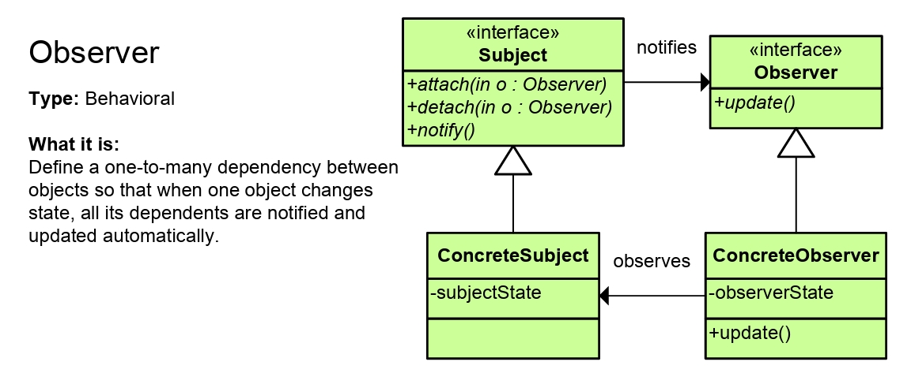

***Groupe 1 - Cpp***

## Design Pattern:Observer

L'Observateur est un motif de conception comportementale qui vous permet de définir un mécanisme d'abonnement pour notifier plusieurs objets de tout événement survenant à l'objet qu'ils observent. Il est conçu pour réaliser le découplage entre les objets, de sorte qu'un changement dans l'état d'un objet puisse être notifié à d'autres objets sans qu'ils aient à être directement liés les uns aux autres.

Modèle UML Générique :
La structure UML générique du motif Observateur comprend les éléments clés suivants :
Sujet : Gère une liste d'observateurs et fournit des méthodes pour ajouter, supprimer et notifier les observateurs. Il s'agit généralement d'une classe abstraite ou d'une interface.
SujetConcret : Implémente l'interface du sujet, responsable de la maintenance de l'état actuel et de la notification de tous les observateurs lorsque l'état change.
Observateur : Définit une méthode de mise à jour pour recevoir des notifications du sujet.
ObservateurConcret : Implémente l'interface de l'observateur, responsable de la logique de mise à jour spécifique.

## Système 

On a implémenté un système d'actuariat et de vente aux enchères qui permet grâce au modèle de conception Observer d'observer les mises à jour liée aux objets et de notifier les echérisseurs.

## Fonctionnalités

- Création et gestion d'objets aux enchères.
- Inscription/création de participants aux enchères (les enchérisseurs).
- Suivi des enchères grâce à l'Observer Pattern.

## Structure du Projet

- **Item.h** et **Item.cpp**    : classe `Item` représente un objet aux enchères.
- **Buyer.h** et **Buyer.cpp**  : classe `Buyer` représente un acheteur participant à une enchère (cet acheteur est lié à un unique Item).
- **Auction.h** et **IBuyer.h** : implémentation du modèle Observer.
- **main.cpp**                  : Programme principal pour illustrer ce modèle dans le cas de vente aux enchères.

## Utilisation

1. Cloner ce dépôt sur votre machine locale : 
	git clone https://github.com/votre_utilisateur/systeme-actuariat-vente-enchere.git
2. Compilation avec makefile : 
	make
3. Exécution du programme : 
	./main

